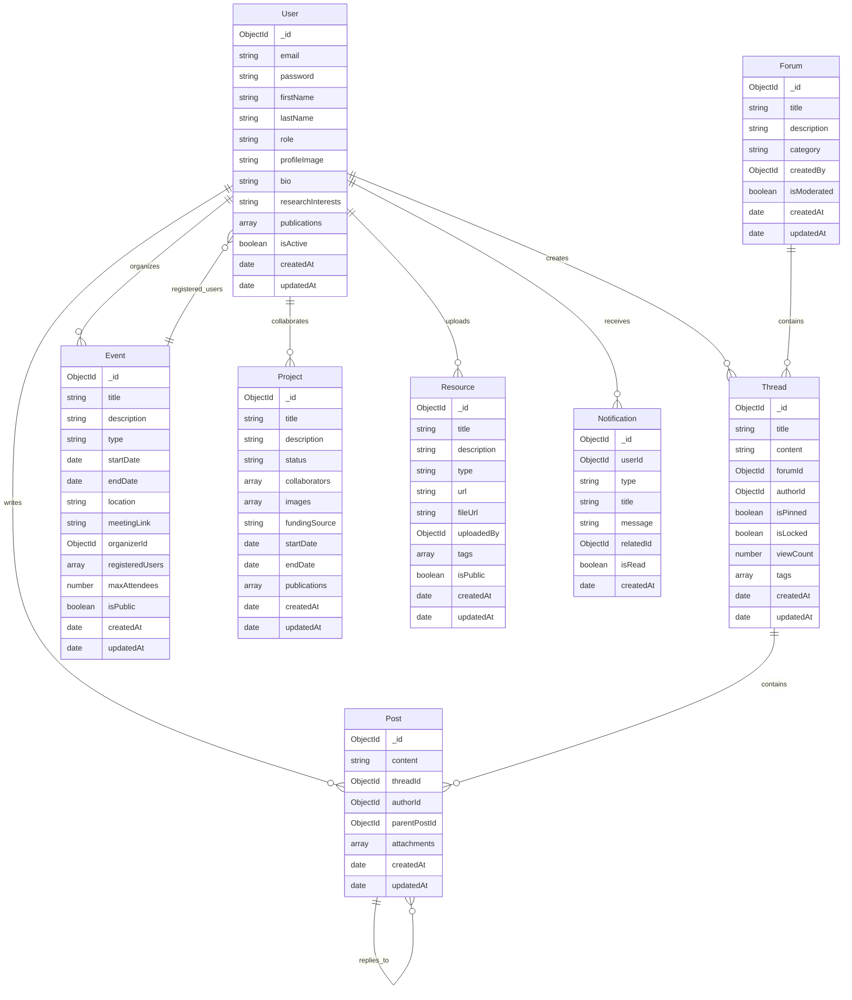

# Deepminds Research Lab Portal - Architecture Plan

## Overview
This document outlines the comprehensive architecture for the Deepminds Research Lab portal, designed to mirror the functionality of https://milab.handong.edu/ while supporting user roles, discussion threads, seminar events, and document sharing.

## Current State Analysis

### Existing Implementation
- **Backend**: Express.js server with MongoDB/Mongoose
- **Frontend**: React with Vite, TailwindCSS, Framer Motion
- **Current Features**: Basic article and video management
- **Hosting**: Render (backend), Vercel (frontend), Cloudinary (files), MongoDB (database)

### Issues Identified
1. **CORS Configuration**: Current CORS setup may be causing API endpoint issues
2. **Authentication**: No user authentication system implemented
3. **Limited Data Models**: Only Article model exists, missing user roles and forum structures
4. **Server Configuration**: Duplicate port definitions in server.js

## Target Architecture

### 1. Database Schema Design



### 2. User Role System

#### Role Definitions
- **Lab Director**: Full administrative access, can manage all content and users
- **Research Members**: Can create discussions, events, upload resources, manage own content
- **Visitors**: Read-only access to public content, can register for public events

#### Permission Matrix
| Feature | Lab Director | Research Members | Visitors |
|---------|-------------|------------------|----------|
| User Management | Full | None | None |
| Forum Moderation | Full | Own posts | None |
| Event Creation | Yes | Yes | No |
| Event Registration | Yes | Yes | Yes (public only) |
| Resource Upload | Yes | Yes | No |
| Project Management | Yes | Yes (assigned) | View only |
| Publication Management | Yes | Own | View only |

### 3. RESTful API Architecture

#### Authentication Endpoints
```
POST /api/auth/register
POST /api/auth/login
POST /api/auth/logout
POST /api/auth/refresh
GET  /api/auth/profile
PUT  /api/auth/profile
POST /api/auth/forgot-password
POST /api/auth/reset-password
```

#### User Management Endpoints
```
GET    /api/users              # Get all users (paginated)
GET    /api/users/:id          # Get user profile
PUT    /api/users/:id          # Update user profile
DELETE /api/users/:id          # Delete user (admin only)
GET    /api/users/role/:role   # Get users by role
```

#### Forum Endpoints
```
GET    /api/forums             # Get all forums
POST   /api/forums             # Create forum (admin only)
GET    /api/forums/:id         # Get forum details
PUT    /api/forums/:id         # Update forum
DELETE /api/forums/:id         # Delete forum

GET    /api/forums/:id/threads # Get threads in forum
POST   /api/forums/:id/threads # Create new thread
GET    /api/threads/:id        # Get thread with posts
PUT    /api/threads/:id        # Update thread
DELETE /api/threads/:id        # Delete thread

POST   /api/threads/:id/posts  # Create post in thread
PUT    /api/posts/:id          # Update post
DELETE /api/posts/:id          # Delete post
```

#### Event Management Endpoints
```
GET    /api/events             # Get all events (with filters)
POST   /api/events             # Create event
GET    /api/events/:id         # Get event details
PUT    /api/events/:id         # Update event
DELETE /api/events/:id         # Delete event
POST   /api/events/:id/register # Register for event
DELETE /api/events/:id/register # Unregister from event
GET    /api/events/:id/attendees # Get event attendees
```

#### Project Endpoints
```
GET    /api/projects           # Get all projects
POST   /api/projects           # Create project
GET    /api/projects/:id       # Get project details
PUT    /api/projects/:id       # Update project
DELETE /api/projects/:id       # Delete project
```

#### Resource Endpoints
```
GET    /api/resources          # Get all resources
POST   /api/resources          # Upload resource
GET    /api/resources/:id      # Get resource details
PUT    /api/resources/:id      # Update resource
DELETE /api/resources/:id      # Delete resource
```

#### Notification Endpoints
```
GET    /api/notifications      # Get user notifications
PUT    /api/notifications/:id/read # Mark notification as read
DELETE /api/notifications/:id  # Delete notification
```

### 4. Frontend Architecture

#### Component Structure
```
src/
├── components/
│   ├── Auth/
│   │   ├── LoginForm.jsx
│   │   ├── RegisterForm.jsx
│   │   └── ProtectedRoute.jsx
│   ├── Forum/
│   │   ├── ForumList.jsx
│   │   ├── ThreadList.jsx
│   │   ├── ThreadView.jsx
│   │   ├── PostEditor.jsx
│   │   └── PostCard.jsx
│   ├── Events/
│   │   ├── EventList.jsx
│   │   ├── EventCard.jsx
│   │   ├── EventDetails.jsx
│   │   ├── EventForm.jsx
│   │   └── EventCalendar.jsx
│   ├── Members/
│   │   ├── MemberGrid.jsx
│   │   ├── MemberCard.jsx
│   │   └── MemberProfile.jsx
│   ├── Projects/
│   │   ├── ProjectGrid.jsx
│   │   ├── ProjectCard.jsx
│   │   └── ProjectDetails.jsx
│   ├── Resources/
│   │   ├── ResourceList.jsx
│   │   ├── ResourceCard.jsx
│   │   └── ResourceUpload.jsx
│   └── Common/
│       ├── Navbar.jsx
│       ├── Footer.jsx
│       ├── SearchBar.jsx
│       ├── Pagination.jsx
│       └── NotificationCenter.jsx
├── pages/
│   ├── Home.jsx
│   ├── Members.jsx
│   ├── Publications.jsx
│   ├── Projects.jsx
│   ├── Resources.jsx
│   ├── Forum.jsx
│   ├── Events.jsx
│   └── Profile.jsx
├── hooks/
│   ├── useAuth.js
│   ├── useApi.js
│   ├── useNotifications.js
│   └── useSocket.js
├── context/
│   ├── AuthContext.jsx
│   └── NotificationContext.jsx
└── utils/
    ├── api.js
    ├── auth.js
    └── constants.js
```

### 5. Security Implementation

#### Authentication Strategy
- **JWT Tokens**: Access tokens (15 minutes) + Refresh tokens (7 days)
- **Password Security**: bcrypt hashing with salt rounds
- **Session Management**: Secure HTTP-only cookies for refresh tokens

#### Authorization Middleware
```javascript
// Role-based access control middleware
const authorize = (roles = []) => {
  return (req, res, next) => {
    if (!req.user) {
      return res.status(401).json({ error: 'Unauthorized' });
    }
    
    if (roles.length && !roles.includes(req.user.role)) {
      return res.status(403).json({ error: 'Forbidden' });
    }
    
    next();
  };
};
```

#### CORS Configuration Fix
```javascript
const corsOptions = {
  origin: [
    'http://localhost:3000',
    'https://deepminds-research-lab-portal.vercel.app',
    'https://deepminds-research-lab-portal-frontend.onrender.com'
  ],
  credentials: true,
  methods: ['GET', 'POST', 'PUT', 'DELETE', 'OPTIONS'],
  allowedHeaders: ['Content-Type', 'Authorization']
};

app.use(cors(corsOptions));
```

### 6. Real-time Features

#### WebSocket Integration
- **Socket.io**: For real-time notifications and forum updates
- **Events**: New posts, event registrations, system announcements
- **Presence**: Online user indicators

### 7. File Management

#### Cloudinary Integration
- **Image Uploads**: Profile pictures, project images, resource thumbnails
- **Document Storage**: PDFs, presentations, research papers
- **Video Hosting**: Seminar recordings, tutorial videos

### 8. Search Implementation

#### Full-text Search
- **MongoDB Text Indexes**: For articles, forum posts, events
- **Advanced Filters**: By date, author, category, tags
- **Search Suggestions**: Auto-complete functionality

### 9. Notification System

#### Notification Types
- **Forum Activity**: New replies, mentions, thread updates
- **Event Updates**: Registration confirmations, reminders, changes
- **System Notifications**: Account updates, announcements

#### Delivery Methods
- **In-app**: Real-time notifications via WebSocket
- **Email**: Digest emails for important updates (future enhancement)

### 10. Performance Optimization

#### Backend Optimizations
- **Database Indexing**: Proper indexes for frequent queries
- **Caching**: Redis for session storage and frequent data
- **Pagination**: Limit data transfer for large datasets
- **Image Optimization**: Cloudinary transformations

#### Frontend Optimizations
- **Code Splitting**: Route-based lazy loading
- **Image Lazy Loading**: Intersection Observer API
- **State Management**: Context API with useReducer
- **Memoization**: React.memo for expensive components

### 11. Deployment Strategy

#### Environment Configuration
```javascript
// Production environment variables
MONGO_URI=mongodb+srv://...
JWT_SECRET=...
JWT_REFRESH_SECRET=...
CLOUDINARY_CLOUD_NAME=...
CLOUDINARY_API_KEY=...
CLOUDINARY_API_SECRET=...
FRONTEND_URL=https://deepminds-research-lab-portal.vercel.app
```

#### CI/CD Pipeline
- **GitHub Actions**: Automated testing and deployment
- **Environment Separation**: Development, staging, production
- **Health Checks**: API endpoint monitoring

### 12. Testing Strategy

#### Backend Testing
- **Unit Tests**: Jest for individual functions
- **Integration Tests**: API endpoint testing
- **Database Tests**: MongoDB memory server

#### Frontend Testing
- **Component Tests**: React Testing Library
- **E2E Tests**: Cypress for user workflows
- **Accessibility Tests**: axe-core integration

## Implementation Priority

### Phase 1: Foundation (Weeks 1-2)
1. Fix CORS and authentication issues
2. Implement user authentication system
3. Create user role management
4. Set up proper database models

### Phase 2: Core Features (Weeks 3-4)
1. Implement forum system
2. Create event management
3. Build member profile system
4. Add basic notification system

### Phase 3: Advanced Features (Weeks 5-6)
1. Document sharing with Cloudinary
2. Real-time notifications
3. Search functionality
4. Project showcase system

### Phase 4: Polish & Deploy (Week 7)
1. UI/UX improvements
2. Performance optimization
3. Testing and bug fixes
4. Production deployment

## Success Metrics

- **User Engagement**: Active forum participation, event registrations
- **Performance**: Page load times < 2 seconds, API response times < 500ms
- **Security**: No authentication vulnerabilities, proper data protection
- **Functionality**: All features from reference site implemented and working

This architecture provides a solid foundation for building a comprehensive research lab portal that mirrors the functionality of the reference site while supporting modern web development best practices.